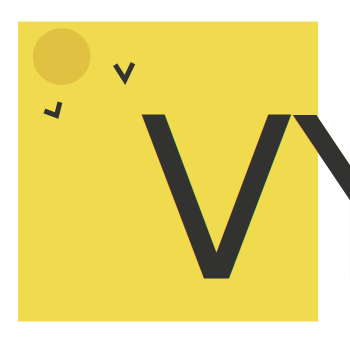
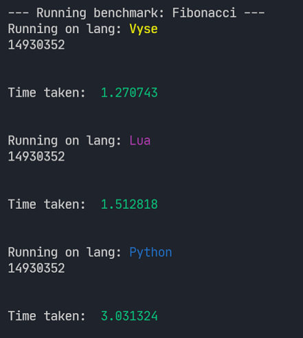

# Vyse

<br />
<p align="center">
  <a href="#">
    
  </a>

  <h2 align="center">Vyse</h2>

  <p align="center">
   An elegant and embeddable programming language
    <br />
    <a href="https://github.com/srijan-paul/vyse/blob/main/doc/manual.md"><b>Visit the language spec »</b></a>
    <a href="https://srijan-paul.github.io/vyse"><b>Website »</b>
    </a>
    <br />
    <br />
    <a href="https://github.com/srijan-paul/vyse/issues">Report Bug</a>
     •
    <a href="https://github.com/srijan-paul/vyse/issues">Request Feature</a>
  </p>
</p>

[](https://www.codacy.com/gh/srijan-paul/snap/dashboard?utm_source=github.com&amp;utm_medium=referral&amp;utm_content=srijan-paul/snap&amp;utm_campaign=Badge_Grade) 

[](https://discord.gg/qvtfJXJMRH)
[](https://github.com/tterb/atomic-design-ui/blob/master/LICENSEs)

Vyse is a dynamically typed, interpreted and fast scriptling language inspired by Lua for rapid prototyping of applications like video games.
(Note that this is a work in progresss project and few of promised are currently under development, It is advised to not use vyse for any development purposes in it's current stage).

## Table of Contents

- [Goal](#Goal)
- [Overview](#Overview)
- [Roadmap](#Roadmap)
- [Implementation](#Implementation)
- [Building](#Building)
- [Running Benchmarks](#Benchmarks)
- [Editor Support](#Editor-Support)
- [Development](#Development)

## Goal

Vyse aims to pick up after the Lua programming language, by adding popularly desired features on top of it,
whilst providing similar speed and minimalism as Lua.
There exist some quirks in Lua that Vyse aims to change.

- Variables are global by default
- Long keywords like `local` and the use of `do .. end` to designate blocks instead of `{}` makes it unlikeable to programmers coming from C.
- The concept of metatables and metamethods is somewhat unintuitive to new programmers.
- Tables being used as both arrays and maps can have unwanted side effects.
- Lacks many features that are common in other languages such as :
  * Compound assignment operators (`+=`, `-=`, `*=`) and decrement and increment operators (`++`, `--`) .
  * `continue` statement for skipping over some loop iterations.
  * `switch` statements.

- Arrays starting at 1 is a a minor issue to some.

Vyse aims to keep most of what Lua provides, but address the aforementioned issues and offer the following QoL feautures:
  - A Familiar syntax for programmers migrating from Javascript and C
  - An easy to integrate C++ API for easy embedding in applications
  - Syntactic sugar for JS like OOP that boils down to the very same metatable and metamethod heirarchy.

## Overview

Here is a rough overview of the language's syntax and features:

```lua
--  variable declaration and assignment
const PI = 3.141659  -- variables declared with const are immutable
let radius = 10

--  Function declaration
fn calculate_area(r) {
  return PI * r ** 2 -- '**' operator is used for exponentiation.
}

let area = calculate_area(radius) -- function calling

--  constructing objects is very similar to Javascript.

let goblin = {
  name: "Bobo",
  health: 12,
  damage: 4,
  attack(target) {
    target.health -= this.damage
		print("Goblin attacks!")
  },
};

--  methods is done with the `:` operator.
let wolf = { health: 20 }
goblin:attack(wolf)

--  Arrays are intuitive too
let numbers = [1, 3, 5, 7, 9]

-- the '#' operator returns length of lists or strings.
print('I have ' .. #numbers .. 'numbers!') // '..' is the concat operator

-- the `<<<` operator can be used to push to arrays
numbers <<< 10 <<< 11

-- looping is very similar to lua.
for i = 1, #numbers  {
	print(numbers[i])
}


--  conditionals
math.randseed(time.now());
const number = math.random(0, 100);

let guess = input():to_number(); -- read user input and parse as a number

while true {
	if guess < number {
		print("Too low! Try higher")
	} else if guess > number {
		print("Too hight! Guess lower")
	} else {
		print("You guessed it! The number was " .. number);
		break
	}
}
```

For a more complete spec of the language, and all it's features visit [manual.md](./doc/manual.md).
Alternatively, read the documentation on [this](https://srijan-paul.github.io/vyse/book/) page.

## Roadmap

Currently, vyse supports basic control flow, variable declaration, usage and basic collection data structures.
To move towards a more complete implementation, the following tasks have to be attended to:

1. [x] Implement parent tables (metatables in Lua). (**DONE**)
2. [x] Add a complete list of collection types (Arrays and tables). (**DONE**)
3. [x] Implement proper error reporting in all the passes. (**DONE**)
4. [x] Full support for Lambdas and closures. (**DONE**)
5. [ ] Optimze value representation to optionally NaN boxed values.
6. [ ] Optimize the garbage collector for incremental collection.
7. [ ] Optimize the VM's loop-dispatch to computed jumps.
8. [ ] Add more compiler passes for better optimization.

## Implementation

Vyse runs on the Vyse Virtual Machine (svm for short). The VM has a stack based architechture that operates on 1 byte long opcodes. To keep the implementation concise and simple, vyse uses a single pass compiler that directly consumes tokens
and emits bytecode.

The stages involved are :

### Lexing / Tokenizing (Source string -> Token)

The vyse lexer resides in the `lang/include/vyse/scanner.hpp` file, A simple hand written lexer that accepts a string returns a
token whenever the method `next_token()` is called.
The Lexer is called from within the Compiler, but can also be instantiated and used stand-alone for testing purposes.

### Compiling (Tokens -> Bytecode)

The Compiler compiles tokens to Bytecode following the Vyse Bytecode Instruction format (`lang/include/opcode.hpp`).
Every instruction is 1 byte long. The compiler returns a function containing all the bytecode from the script, which is
then loaded into the VM and called.

### VyVM

The design of the VyVM is very similar to the Lua Virtual Machine despite the fact that it's Stack based as opposed to LuaVM's register based design (after version 5.1). It consists of a value stack and an accumulator register.
It has full support for lambdas and closures following Lua's upvalue design.

# Building

To build vyse from source, it is recommended that you use CMake (version 3.13 or higher).
The build tool used here is Ninja, but you can use any other build tool of your preference (eg- `'Unix Makefiles'`).

After downloading/cloning vyse into a directory, `cd` into it and run the following commands to run the tests:

```bash
mkdir bin
cd bin
cmake .. -G Ninja -DCMAKE_EXPORT_COMPILE_COMMANDS=1 -DCMAKE_C_COMPILER=clang -DCMAKE_CXX_COMPILER=clang++
ninja
./vy <filename>
```

Note that `-CMAKE_C_COMPILER=clang -CMAKE_CXX_COMPILER=clang++` are optional, and you can use any C++ compiler toolchain of your liking. The above will build the compiler in **Debug** mode.
To build in release mode, add the `-DCMAKE_BUILD_TYPE=Release` argument.

# Benchmarks

The benchmarks for vyuse are present in the `benchmark` directory.
The `benchmark/run.py` script can be used to compare Vyse against other languages.
You can either run all benchmarks, or run specific benchmarks.

To run all benchmarks, enter the following into your shell:
```sh
cd benchmarks
py run.py
```

To run, a specific benchmark, use the `--bench` option:

```sh
py run.py --bench=fib
```

# Tests

For testing, the `ctest` utility is used along with some hand written helper headers.
To run existing tests, run `ctest` inside the build directory (`bin` or `out`).
Tests of all kinds can be found under the `test` directory.




(Note: time is in seconds)

If your terminal does not have ASNI support, or you want to pipe the benchmarks to a
file for reporting, then you can use the `--nocolor` flag.


# Editor-Support

Currently, syntax highlighting and code completion snippets are supported on the following code editors:

- [x] [VS Code](https://github.com/srijan-paul/vscode-vyse)
- [ ] Sublime text [In Progress]
- [ ] Vim [Coming soon]
- [ ] Atom [Coming soon]

# Development

If you're looking to fork contribute to vyse, It is recommended to have clang-format for formatting and clangd language server for your text editor. On VSCode, the `C/C++` extension can be used to debug the executable. Alternatively, you can use GDC/LLDB or other debuggers to your liking.

All the source and header files for vyse are present in the `lang` directory in the project's root folder.
